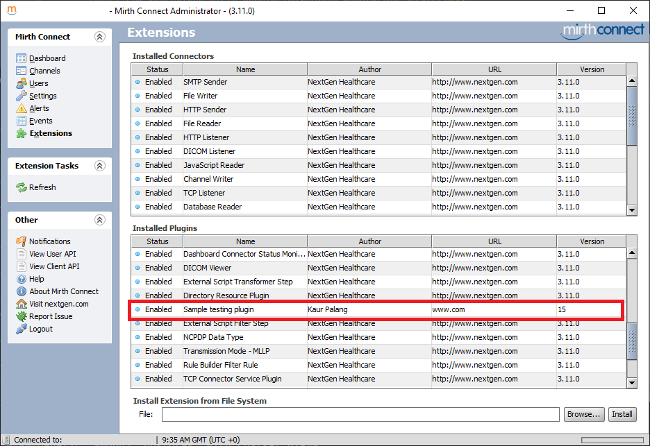

# Unofficial Mirth plugin guide

This is an unofficial collection of tips and tricks on the topic of Mirth Connect plugin creation. Enjoy!

---

## Foreword
If you, the reader, have any suggestions, questions, or anything at all you'd like to add, please either create a pull-request or an Issue and I'll look into it.

Also I'm going to be use _**Mirth**_ to refer to [this product](https://github.com/nextgenhealthcare/connect/), regardless of how it is officially named at the time.

---

## General overview

Mirth repository consists of eight sub-projects:
- client
- command
- donkey
- generator
- manager
- server
- simplesender
- webadmin

### Client
The client subproject contains the code for, you guessed it, the Mirth Administrator. That includes the code for the bare UI itself, aswell as code for different connectors and other plugins. The authors of Mirth are clever in the sense that they make all their official additions in the form of plugins, so plugin interfaces are kept up to date.

### Command
This subproject contains code for the commandline interface, or CLI. As you can see there's not much there.

### Donkey
Donkey is the foundation on which Mirth is built. It's a collection of core models, some utility classes, part of the server's inner workings, database classes, and such. Plugin writers don't usually have to add stuff here.

### Generator
_To be fleshed out_

### Manager
_To be fleshed out_

### Server
The server subproject includes the _servery_ part of the Mirth product. This includes data and message manipulation, message parsing, and all that good stuff.

### SimpleSender
_To be fleshed out_

### WebAdmin
_To be fleshed out_

---

## Requirements
- Java JDK - I suggest version 1.8 because the UI part of Mirth uses that. I'm going to use a [Temurin build](https://adoptium.net/index.html?variant=openjdk8&jvmVariant=hotspot). You can get installation instructions for your OS version at the bottom of that page. Since I'm using Linux I'm going to install that from my package manager.
 - Any JDK should work, the key is to get a JDK that comes with `JavaFX`
 - If you get an error like `this version of the Java Runtime only recognizes class file versions up to 52.0` this is resolved by updating to a newer JDK
- Maven - You can download a version of Maven [here](https://maven.apache.org/index.html). I'm going to use version 3.8.3.

We will also be using another neat tool of mine, a [mirth-plugin-maven-plugin](https://github.com/kpalang/mirth-plugin-maven-plugin), which will save us some manual work later on. You don't have to do anything with it right now.

---

## 0 - Preparation
A fair first place would be to clone yourself a copy of [Mirth Connect](https://github.com/nextgenhealthcare/connect/). That way you can take a look at the structure and inheritance of Mirth classes.

So... `git clone git@github.com:nextgenhealthcare/connect.git`. Now open the resulting folder up in your favorite IDE. I'm going to use [IntelliJ](https://www.jetbrains.com/idea/) cause I like that one.

Another good idea is to clone my [Mirth sample plugin](https://github.com/kpalang/mirth-sample-plugin) to get a general idea of the plugin file tree. Also we will be using Maven to build the project, so that's something to look up if you haven't already.

Using the "Administrator Launcher" for Mirth Connect is a good idea in general but is specifically useful for plugin development. The launcher helps a plugin developer by managing cache and also allowing for self-signed plugin code to be executed. It is free, but closed-source and is available from the [NextGen Downloads Page](https://www.nextgen.com/products-and-services/mirth-connect-downloads)

And finally I've made a [Docker image](https://hub.docker.com/r/kpalang/connect/) that includes a JVM option that enables remote debugging. This will come handy later, but now I'm going to set up a Docker container. The container will be useful for quick runs to check if the plugin works or not. It's also all sandboxed so you pretty much need one command to run it and another one to stop it. I've included a sample [docker-compose.yaml](/docker-compose.yaml).

---

## 1 - Getting started
The part you've been waiting for. I'm going to clone [my sample plugin](https://github.com/kpalang/mirth-sample-plugin), because it already has some of the work done for us: `git clone git@github.com:kpalang/mirth-sample-plugin.git`

The sample plugin structure consists of four main parts:
1. client
1. distribution
1. server
1. shared

Client module (as in Maven lingo) will get all the code that as to do with the UI. Distribution module is not actually related to the functionality of our plugin, but is actually needed to make our life packaging that plugin a tad easier. Server module get all the backend bits of our code. And finally, shared module gets all those bits that are needed on both sides of our plugin, UI and backend.

Additionally, you will find a `certificate` folder, which contains a readymade self-signed certificate that will sign our plugin in the name of BigCompany located in Big City, and a `libs` folder. Now `libs` folder will contain the libraries we want to include in our project separated by times. Anything we want to use at compiletime will go into `libs/compiletime`, and anything we need at runtime, when our plugin is running already, will go into `libs/runtime`.

You will also see a `pom.xml` file in your project root. This is our Maven project's definition. The general structure of `pom.xml` is not in the scope of this guide, but let's go over the relevant bits.


```xml
<properties>
    <!--
    We're using a custom annotation processor from
    the mirth-plugin-maven-plugin and this line
    specifies a place where that processor stores it's inner data.
    -->
    <processor.aggregator.path>distribution/aggregator/aggregated.json</processor.aggregator.path>


    <!--
    Here are plugin details.

    Some of these will be shown in
    the extensions view in Mirth Administrator.
    -->

    <!-- this is the name of the folder
    that gets put into mirthroot/extensions -->
    <plugin.path>plugintest</plugin.path>

    <!-- The name of your plugin -->
    <plugin.name>Sample testing plugin</plugin.name>

    <!-- Would you like to display your homepage? -->
    <plugin.url>www.com</plugin.url>

    <!-- The name of the author. You, your company, anything you like really -->
    <plugin.author>Kaur Palang</plugin.author>

    <!-- What version would you like to display in Mirth Administrator -->
    <plugin.version>15</plugin.version>

    <!--
    The version of Mirth your plugin is compatible with.
    This can also be a comma-separated list:
    3.10.0, 3.10.1, 3.11.0
    -->
    <plugin.mirthVersion>3.12.0</plugin.mirthVersion>

    <!-- This property sets the name of your eventual zipfile -->
    <plugin.archive.name>sampleplugin</plugin.archive.name>
</properties>
```



```xml
<!--
This bit specifies a Nexus repository I'm
hosting for Mirth jarfiles so we don't have
to manually extract them from Mirth itself.
-->
<repositories>
    <repository>
        <id>nexus</id>
        <url>https://maven.kaurpalang.com/repository/maven-public/</url>
    </repository>
</repositories>

<dependencies>
    <!-- Helper plugin to handle Mirth plugin specific tasks. -->
    <dependency>
        <groupId>com.kaurpalang</groupId>
        <artifactId>mirth-plugin-maven-plugin</artifactId>
        <version>${mirth-plugin-maven-plugin.version}</version>
    </dependency>
</dependencies>
```

The last thing we'll cover is the following. This bit makes sure our plugin get signed and sets the required parameters.
```xml
<plugin>
    <groupId>org.apache.maven.plugins</groupId>
    <artifactId>maven-jarsigner-plugin</artifactId>
    <version>${maven-jarsigner-plugin.version}</version>
    <executions>
        <execution>
            <id>sign</id>
            <goals>
                <goal>sign</goal>
            </goals>
        </execution>
    </executions>
    <configuration>
        <!-- Path to our keystore -->
        <keystore>${project.parent.basedir}/certificate/keystore.jks</keystore>
        <!-- The name of our certificate -->
        <alias>selfsigned</alias>
        <!-- Password to access the keystore -->
        <storepass>storepass</storepass>
        <!-- Password for the certificate -->
        <keypass>keypass</keypass>
    </configuration>
</plugin>
```

You don't have to touch anything else for now.

Now let's run `mvn clean package` to make sure our plugin builds properly. You should see `distribution/target/sampleplugin.zip` pop up. Take a peek inside to get an idea of what the archive will look like. I'm not going to cover it here.

After all this initial tweaking I've come to a state as in [this commit](https://github.com/kpalang/mirth-sample-plugin/tree/d3b36ea63a893332f6e0eda5283d88f00e8dc25c) (_I modified some other stuff aswell but that's unimportant right now..._).</br> **NOTE:** Your current state may differ a bit depending on when you clone the repository.

---

## 2 - Writing serverside code

The easiest way to get that _ofmygoditworks_ kick is to go into `server` module and edit `MyServicePlugin.java`.

```java
package com.kaurpalang.mirthpluginsample.server;

import com.kaurpalang.mirth.annotationsplugin.annotation.ServerClass;
import com.kaurpalang.mirthpluginsample.shared.Constants;
import com.mirth.connect.model.ExtensionPermission;
import com.mirth.connect.plugins.ServicePlugin;

import java.util.HashMap;
import java.util.Map;
import java.util.Properties;

@ServerClass
public class MyServicePlugin implements ServicePlugin {

    @Override
    public void init(Properties properties) {
        System.out.println("Hello world from init!");
    }

    @Override
    public void update(Properties properties) {
        // We don't need to do anything here.
    }

    @Override
    public Properties getDefaultProperties() {
        return new Properties();
    }

    @Override
    public ExtensionPermission[] getExtensionPermissions() {
        return new ExtensionPermission[0];
    }

    @Override
    public Map<String, Object> getObjectsForSwaggerExamples() {
        return new HashMap<>();
    }

    @Override
    public String getPluginPointName() {
        return Constants.PLUGIN_POINTNAME;
    }

    @Override
    public void start() {
        System.out.println("Hello world from start!");
    }

    @Override
    public void stop() {
        System.out.println("Good bye world!");
    }
}
```
You'll notice in the function `getPluginPointName()`, I've referenced a `Constants` class from the `shared` module. This is so we can reference the same... _constants_, in both server- and client-side code.

After editing the strings in this class, build the plugin with `mvn clean package`, install the plugin, the zip file will be in `distribution/target/` on your server and restart said server.</br>
If you used the container from above, your logs should look something like this:
```
Found 1 custom extensions.
Listening for transport dt_socket at address: 5005
Hello world from init!
Hello world from start!
INFO  2021-11-26 12:54:09,496 [Main Server Thread] com.mirth.connect.server.Mirth: Mirth Connect 3.12.0 (Built on September 2, 2021) server successfully started.
INFO  2021-11-26 12:54:09,498 [Main Server Thread] com.mirth.connect.server.Mirth: This product was developed by NextGen Healthcare (https://www.nextgen.com) and its contributors (c)2005-2021.
INFO  2021-11-26 12:54:09,498 [Main Server Thread] com.mirth.connect.server.Mirth: Running Eclipse OpenJ9 VM 11.0.12 on Linux (5.4.0-90-generic, amd64), postgres, with charset UTF-8.
INFO  2021-11-26 12:54:09,499 [Main Server Thread] com.mirth.connect.server.Mirth: Web server running at http://10.10.1.3:8080/ and https://10.10.1.3:8443/
```
...


---

## 3 - Preparing for communcations with UI (aka REST API)

_Note. [I refactored `Constants` to `MyConstants`](https://github.com/kpalang/mirth-sample-plugin/commit/568ef245a204dae3ffa1ae23efa9c862073d555e) to get more clarity between this and the one in mirth-plugin-maven-plugin._

Right, now that you've got your hacking gloves on, lets start making our plugin controllable by adding API endpoints.

First we need an object to transfer. We _could_ use just a String, but that way we won't see the automatic serialisation of POJOs. I chose to create a `MyInfoObject.java` class. This class has to go into the `shared` module, because that object has to be available to both server and client parts of our plugin. I also chose to place it in `com.kaurpalang.mirthpluginsample.shared.model` package, just to make the codebase more readable.

So, the POJO:
```Java
package com.kaurpalang.mirthpluginsample.shared.model;

public class MyInfoObject {
    private String data;

    public MyInfoObject(String data) {
        this.data = data;
    }

    public String getData() {
        return data;
    }

    public void setData(String data) {
        this.data = data;
    }
}
```

Ooor... _hint, hint..._ [lombok](https://projectlombok.org/)
```java
package com.kaurpalang.mirthpluginsample.shared.model;

import lombok.AllArgsConstructor;
import lombok.Getter;
import lombok.Setter;

@AllArgsConstructor
public class MyInfoObject {
    @Getter @Setter private String data;
}
```

Mirth's API mechanic comprises mostly of two parts. A serverside servlet class and a shared servlet interface class. The servlet class is the one actually doing the work, therefore it has to run on the server. Servelet interface on the other hand has to be shared because the client will call servlet interface classes directly. This wasy we can also utilize XStream for pojo (de-)serialization.

```java
package com.kaurpalang.mirthpluginsample.shared.interfaces;

import com.kaurpalang.mirth.annotationsplugin.annotation.ApiProvider;
import com.kaurpalang.mirth.annotationsplugin.type.ApiProviderType;
import com.kaurpalang.mirthpluginsample.shared.MyPermissions;
import com.kaurpalang.mirthpluginsample.shared.model.MyInfoObject;
import com.mirth.connect.client.core.ClientException;
import com.mirth.connect.client.core.Operation;
import com.mirth.connect.client.core.api.BaseServletInterface;
import com.mirth.connect.client.core.api.MirthOperation;
import com.mirth.connect.client.core.api.Param;
import io.swagger.v3.oas.annotations.Parameter;
import io.swagger.v3.oas.annotations.media.Content;
import io.swagger.v3.oas.annotations.media.Schema;
import io.swagger.v3.oas.annotations.responses.ApiResponse;
import io.swagger.v3.oas.annotations.tags.Tag;

import javax.ws.rs.*;
import javax.ws.rs.core.MediaType;

@Path("/myplugin")
@Tag(name = "MyPlugin operations")
@Consumes({ MediaType.APPLICATION_XML, MediaType.APPLICATION_JSON })
@Produces({ MediaType.APPLICATION_XML, MediaType.APPLICATION_JSON })
@ApiProvider(type = ApiProviderType.SERVLET_INTERFACE)
public interface MyServletInterface extends BaseServletInterface {

    @GET
    @Path("/getsomething")
    @Consumes({ MediaType.APPLICATION_XML, MediaType.APPLICATION_JSON })
    @Produces({ MediaType.APPLICATION_XML, MediaType.APPLICATION_JSON })
    @ApiResponse(responseCode = "200", description = "Found the information",
            content = {
                    @Content(mediaType = MediaType.APPLICATION_JSON, schema = @Schema(implementation = MyInfoObject.class)),
                    @Content(mediaType = MediaType.APPLICATION_XML, schema = @Schema(implementation = MyInfoObject.class))
            })
    @MirthOperation(
            name = "getSomething",
            display = "Get important information",
            permission = MyPermissions.GETSTH,
            type = Operation.ExecuteType.ASYNC
    )
    MyInfoObject getSomething(
            @Param("identifier") @Parameter(description = "The identifier of our important information to retrieve.", required = true) @QueryParam("identifier") String identifier)
            throws ClientException;
}
```

Lets go over this one-by-one:

#### Swagger stuff

`@Path("/myplugin")`</br>
This annotation sets parent path of our endpoints:</br>
`https://localhost:8443/api/myplugin/`

--</br>
`@Consumes({ MediaType.APPLICATION_XML, MediaType.APPLICATION_JSON })`</br>
This annotation tells Swagger our endpoint can consume either XML or JSON inputs</br>

--</br>
`@Produces({ MediaType.APPLICATION_XML, MediaType.APPLICATION_JSON })`</br>
This one tells Swagger out endpoint produces either XML or JSON</br>

#### Not Swagger stuff

`@ApiProvider(type = ApiProviderType.SERVLET_INTERFACE)`</br>
This line tells mirth-plugin-maven-plugin to include this class in our plugin's `plugin.xml` as the following line, which in turn tells Mirth to handle our class as a servlet interface.</br>
```xml
<apiProvider name="com.kaurpalang.mirthpluginsample.shared.interfaces.MyServletInterface" type="SERVLET_INTERFACE"/>
```
--</br>
`public interface MyServletInterface extends BaseServletInterface`</br>
BaseServletInterface is Mirth's BaseServletInterface... interface... It creates a foundation to base our servlet interfaces on...

--</br>
More Swagger stuff we touched just above

--</br>
```java
@ApiResponse(
  responseCode = "200",
  description = "Found the information",
  content = {
          @Content(mediaType = MediaType.APPLICATION_JSON, schema = @Schema(implementation = MyInfoObject.class)),
          @Content(mediaType = MediaType.APPLICATION_XML, schema = @Schema(implementation = MyInfoObject.class))
})
```
This part tells Swagger to use our POJO class as on output example. Also, automagic serialization ;) I'll show you the picture in a second.

--</br>
```java
@MirthOperation(
    name = "getSomething",
    display = "Get important information",
    permission = MyPermissions.GETSTH
)
```
This annotation dictates first, who can execute it. TBH I don't really know right now what the permission parameter does, but I'd guess it allows for permission control if you've got the premium User Roles plugin installed.
Also you can see I've put the permission string into [it's own class](https://github.com/kpalang/mirth-sample-plugin/blob/main/shared/src/main/java/com/kaurpalang/mirthpluginsample/shared/MyPermissions.java).</br>
And secondly, this creates event messages in Events view in Mirth Administrator.


--</br>
```java
MyInfoObject getSomething(
            @Param("identifier") @Parameter(description = "The identifier of our important information to retrieve.", required = true) @QueryParam("identifier") String identifier)
            throws ClientException;
```
Finally the function itself. Geez. Well it specifies what does in and what comes out of our function...

#### Grand middle finale
If you've done everything more or less like I've done above, you should see something like this:


I know right...


</br>
</br>
</br>

Okay now, stop rubbing yourself. We've still got to implement the interface.
```Java
package com.kaurpalang.mirthpluginsample.server.servlet;

import com.kaurpalang.mirth.annotationsplugin.annotation.ApiProvider;
import com.kaurpalang.mirth.annotationsplugin.type.ApiProviderType;
import com.kaurpalang.mirthpluginsample.shared.MyConstants;
import com.kaurpalang.mirthpluginsample.shared.interfaces.MyServletInterface;
import com.kaurpalang.mirthpluginsample.shared.model.MyInfoObject;
import com.mirth.connect.server.api.MirthServlet;

import javax.servlet.http.HttpServletRequest;
import javax.ws.rs.core.Context;
import javax.ws.rs.core.SecurityContext;

@ApiProvider(type = ApiProviderType.SERVER_CLASS)
public class MyPluginServlet extends MirthServlet implements MyServletInterface {

    public MyPluginServlet(@Context HttpServletRequest request, @Context SecurityContext sc) {
        super(request, sc, MyConstants.PLUGIN_POINTNAME);
    }

    @Override
    public MyInfoObject getSomething(String identifier) {
        String data = String.format("<%s> Some important informations", identifier);
        return new MyInfoObject(data);
    }
}
```
To be honest, only the `@ApiProvider` annotation deserves attention here. Notice the type is now `ApiProviderType.SERVER_CLASS`, as opposed to `ApiProviderType.SERVLET_INTERFACE` in `MyServletInterface`. It tells mirth-plugin-maven-plugin to put this line in our plugin definition file which tells Mirth this class is a Servlet class and that it should process this:
```XML
<apiProvider name="com.kaurpalang.mirthpluginsample.server.servlet.MyPluginServlet" type="SERVER_CLASS"/>
```

Right. Now you should be in a state [something like this](https://github.com/kpalang/mirth-sample-plugin/tree/d0029888ca978bbb9b8dabdd04446a8b408510c9).

---

## 4 - GUI

Right, now that we've gone over some of the behind the scenes stuff, it's time to make our plugin look sexy. ;)

First, we're going to add a couple of dependencies. Namely mirth-client.jar and MigLayout</br>
I'm going add a property to our main `pom.xml` in the root of our project:
```xml
<properties>
    ...

    <miglayout.version>3.7.4</miglayout.version>

    ...
</properties>
```
And then the two dependencies to `client/pom.xml`:
```xml
<dependencies>
    <dependency>
        <groupId>com.mirth.connect</groupId>
        <artifactId>mirth-client</artifactId>
        <version>${mirth.version}</version>
    </dependency>

    <dependency>
        <groupId>com.miglayout</groupId>
        <artifactId>miglayout</artifactId>
        <version>${miglayout.version}</version>
    </dependency>

    ...
</dependencies>
```
The first dependency, `mirth-client`, contains all the stuff that Mirth has for it's UI creation. Custom Swing elements, the client-side plugin points, etc.

And MigLayout is a layout manager for Swing and SWT. _MiG Layout makes complex layouts easy and normal layouts zero-liners._ as they say themselves. I can't say much else about it...</br>

Also, a sample commit can be found [here](https://github.com/kpalang/mirth-sample-plugin/commit/27b52400a3c554f37ff4dd6e0a5ca6403e575401)

##### _Get on with the GUI already!_

I've chosen to make a settings tab for our plugin. We will also make it communicate with the server, because it is sort of needed to create any meaningful functionality.

Now, all Mirth UI plugins are loaded in from the following list in our `plugin.xml` file (_which is generated by `mirth-plugin-maven-plugin`_). This definition tells Mirth to load and run this class when a client connects.
```XML
<clientClasses>
    <string>com.kaurpalang.mirthpluginsample.client.MySettingsPlugin</string>
</clientClasses>
```

And the way to autogenerate this definition is to add the `@ClientClass` annotation to our class.
```Java
@ClientClass
public class MySettingsPlugin {
}
```

Basically this is everything we need to get Mirth to load our class. __BUT__, there's not much Mirth can do with it, since it has no instructions on how it behaves. For that we have to make it extend a plugin point. I've listed the client points [here](plugin-types/client/).

We're going to extend [SettingsPanelPlugin](plugin-types/client/SettingsPanelPlugin.md).
```java
@ClientClass
public class MySettingsPlugin extends SettingsPanelPlugin {

    public MySettingsPlugin(String name) {
        super(name);
    }

    @Override
    public AbstractSettingsPanel getSettingsPanel() {
        return null;
    }

    @Override
    public String getPluginPointName() {
        return MyConstants.PLUGIN_POINTNAME;
    }

    @Override
    public void start() {
        System.out.println("Hello from the other slide!");
    }

    @Override
    public void stop() {

    }

    @Override
    public void reset() {

    }
}
```

Let's go over the important parts.

The constructor structure is inherited from Mirth's base `ClientPlugin` class. We don't have to touch that.

The `getSettingsPanel()` function is native to the `SettingsPanelPlugin` plugin type. Mirth uses this method to get the info to display our settings panel from our plugin. It returns a `null` right now, but we'll fix this in a moment.
The `getPluginPointName()` is already familiar from the server section. Pointname is pretty much what identifies our plugin.
And finally, the `start()`, `stop()`, and `reset()` hooks are pretty much self-explanatory. They get called when the plugin is started, stopped, or reset.

Now to get our plugin to actually start, we need to provide a settings panel. Otherwise the Admin Launcher throws a NullPointerException. To provide the settings panel, all we have to do is add a private variable and initialize it.
```java
@ClientClass
public class MySettingsPlugin extends SettingsPanelPlugin {

    private MainSettingsPanel mainSettingsPanel;

    ...

    @Override
    public AbstractSettingsPanel getSettingsPanel() {
        return this.mainSettingsPanel;
    }

    @Override
    public void start() {
        System.out.println("Hello from the other slide!");
        this.mainSettingsPanel = new MainSettingsPanel();
    }

    ...
}
```

Don't worry about the missing MainSettingsPanel class, we will create it right away.</br>
Now MigLayout is the part where our code get some mass into it. I'm not too familiar with building layouts in Java, but the following should suffice.

```java
package com.kaurpalang.mirthpluginsample.client.panel;

import com.kaurpalang.mirthpluginsample.shared.MyConstants;
import com.mirth.connect.client.ui.AbstractSettingsPanel;
import com.mirth.connect.client.ui.components.MirthCheckBox;
import com.mirth.connect.client.ui.components.MirthPasswordField;
import com.mirth.connect.client.ui.components.MirthTextField;
import net.miginfocom.swing.MigLayout;

import javax.swing.*;
import javax.swing.border.TitledBorder;
import java.awt.*;

public class MainSettingsPanel extends AbstractSettingsPanel {

    /**
     * Create component variables
     */
    private JLabel forcefulLabel;
    private MirthCheckBox forcefulCheckbox;

    private JLabel remoteUsernameLabel;
    private MirthTextField remoteUsernameTextField;

    private JLabel remotePasswordLabel;
    private MirthPasswordField remotePasswordField;

    private JButton testRemoteButton;

    public MainSettingsPanel() {
        // The name of our tab in the Settings menu
        super(MyConstants.SETTINGS_TABNAME_MAIN);
        initComponents();
    }

    private void initComponents() {
        setBackground(Color.WHITE);
        setBorder(BorderFactory.createEmptyBorder(0, 0, 0, 0));
        setLayout(new MigLayout("insets 12, novisualpadding, hidemode 3, fill, gap 6", "", "[][][][grow]"));

        /**
         * Instantiate component variables
         */
        forcefulLabel = new JLabel("Force push:");
        forcefulCheckbox = new MirthCheckBox();
        forcefulLabel.setToolTipText("This is a\nmultiline tooltip ;)");
        forcefulCheckbox.setBackground(Color.WHITE);

        remoteUsernameLabel = new JLabel("Username:");
        remoteUsernameTextField = new MirthTextField();

        remotePasswordLabel = new JLabel("Password:");
        remotePasswordField = new MirthPasswordField();

        testRemoteButton = new JButton("Do a thing button");

        /**
         * Create the base container for our components
         */
        JPanel deetsPanel = new JPanel();
        deetsPanel.setLayout(new MigLayout("insets 12, novisualpadding, hidemode 3, fill, gap 6", "[]12[][grow]", ""));
        deetsPanel.setBackground(Color.WHITE);
        deetsPanel.setBorder(
                BorderFactory.createTitledBorder(
                        BorderFactory.createMatteBorder(1, 0, 0, 0, new Color(204, 204, 204)),
                        "MyPlugin",
                        TitledBorder.DEFAULT_JUSTIFICATION,
                        TitledBorder.DEFAULT_POSITION,
                        new Font("Tahoma", 1, 11)
                )
        );

        /**
         * Add our components to the base container
         */
        deetsPanel.add(forcefulLabel, "right");
        deetsPanel.add(forcefulCheckbox);
        deetsPanel.add(remoteUsernameLabel, "newline, right");
        deetsPanel.add(remoteUsernameTextField, "w 168!");
        deetsPanel.add(remotePasswordLabel, "newline, right");
        deetsPanel.add(remotePasswordField, "w 168!");
        deetsPanel.add(testRemoteButton, "newline");

        /**
         * Add base container to Mirth's more base-er container
         */
        add(deetsPanel, "growx");
    }

    @Override
    public void doRefresh() {

    }

    @Override
    public boolean doSave() {
        return false;
    }
}
```

I'm not going to cover building layouts in this guide.</br>
This is what you need. Now is the time to
1. build our plugin again using `mvn clean package` command
1. install the zip archive at `distribution/target`
1. restart Mirth

#### Pay attention here!

If you start you Launcher like you usually do, though the shortcut the installation created, you're not going to be able to log in to Mirth. This is because our plugin is signed using a self-signed certificate and this is something Mirth Administrator Launcher explicitly distrusts in a production environment.</br>
To get around this limitation, we're going to have to start our launcher with a `-k` flag.

> **Only use this for developing self-signed plugins. Get a real code signing certificate before deploying to production!**

__Windows__:
1. Find your launcher shortcut location, it's usually at `C:\ProgramData\Microsoft\Windows\Start Menu\Programs\Mirth Connect Administrator Launcher\`
1. Create a copy of that shortcut. Ctrl+C and then Ctrl+V.
1. Right-click on your new shortcut and choose properties
1. Now append `-k` to the `Target` field in the `Shortcut` tab</br>

1. Click save

__MacOS__:
1. Open `Terminal` and use the command line. 
1. Navigate `cd /Applications/Mirth Connect Administrator Launcher.app/Contents/java/app`
1. Execute `java -jar mirth-client-launcher.jar -k -d`

__Linux__:
1. You're on Linux. You figure it out :) Linux should be very similar to MacOS. Find the install path to the JAR, run the jar with the `-k` flag.

The full list of flags can be found when running `launcher --help`, but I'll list the options for launche version 1.2.0 here:
```
usage: launch
 -a,--address <arg>            The address to connect to Mirth Connect
                               with.
 -d,--allow-incorrect-digest   Allows JARs that fail digest verification.
                               This should only be used for
                               development/testing purposes.
 -h,--help                     Prints this help message.
 -j,--java-console             If specified, the Administrator will be
                               launched with a Java console dialog.
 -k,--allow-self-signed        Allows JARs signed with self-signed
                               certificates to be verified. This should
                               only be used for development/testing
                               purposes.
 -m,--max-heap-size <arg>      The client-side max heap size to use when
                               launching the Administrator.
 -o,--stay-open                If specified, the launcher will stay open
                               after launching the Administrator.
 -v,--use-same-jvm             If specified, the Administrator will be
                               launched using the same JVM as the
                               launcher. Useful when you don't have access
                               to a launcher script.
```

It's also a really good idea to enable Java console. The Java Console is where the logs from the Mirth client are logged.</br>


Now if you click `Launch` you will be greeted with a window asking if you trust the certificate we signed our plugin with. Click `Yes` and we will be on our merry way. Of course this certificate is not something to sign our production code with, but it will do for now.</br>


After logging in, you should be greeted with an image such as this:</br>


Also the state of you code should be similar to [this commit](https://github.com/kpalang/mirth-sample-plugin/tree/f2b3251a8cb48e151bf0d3210ce163c31151fcd8).

---

## ? - Signing and publishing
Mirth Connect plugins need to be signed with a code-signing certificate. This certificate can be either self-signed or bought from a proper certificate authority. There have been some debate over which certificate authorities are trusted by Mirth. I've had success with [DigiCert](https://www.digicert.com/).

### Self-signed certificate
We are going to use a self-signed certificate to sign our plugin because official certificates cost a couple hundred dollars. But fret not, for a self-signed works for our current purpose of getting the plugin running on Mirth. Selfsigned certificates can be generated with the following command:
```
keytool -genkey -keyalg RSA -keysize 2048 -alias selfsigned -keystore keystore.jks -storepass storepass -validity 360 -storetype JKS
```
Let's go over what some of this means:
- RSA - This is the algorithm our certificate is going to use
- 2048 - Size of our certificate in bits
- selfsigned - This is the name of our certificate. You can use whatever you want here, but make sure to replace other occurrences aswell then.
- keystore.jks - The name of the generate keystore file.
- storepass - The password for our keystore. __*Password for the certificate itself will come later*__
- 360 - Validity of our certificate in days
- JKS - Our certificate has to be in the proprietary JKS format

After entering the previous command, you'll be greeted with the following view:
```
What is your first and last name?
  [Unknown]:  John Doe
What is the name of your organizational unit?
  [Unknown]:  IT Department
What is the name of your organization?
  [Unknown]:  Big Bucks Corp.
What is the name of your City or Locality?
  [Unknown]:  New York
What is the name of your State or Province?
  [Unknown]:  Texas
What is the two-letter country code for this unit?
  [Unknown]:  US
Is CN=John Doe, OU=IT Department, O=Big Bucks Corp., L=New York, ST=Texas, C=US correct?
  [no]:  yes

Enter key password for <selfsigned>
        (RETURN if same as keystore password):  
Re-enter new password: 

Warning:
The JKS keystore uses a proprietary format. It is recommended to migrate to PKCS12 which is an industry standard format using "keytool -importkeystore -srckeystore keystore.jks -destkeystore keystore.jks -deststoretype pkcs12".
```

I've gone ahead and filled this out with some informations already :) </br>
After this all you have to do is copy the resulting keystore into the [`certificate`](https://github.com/kpalang/mirth-sample-plugin/tree/main/certificate) directory in the plugin's root and if needed, update the passwords [for JarSigner](https://github.com/kpalang/mirth-sample-plugin/blob/main/pom.xml#L121-L122).

## Debugging and Best Practices

Once you have your basic build working, now the real work starts. You actuall have to write and implement your plugin.

### Learn From the Community

### Use the Java debugger

MC works like any other Java application with regards to debugging. The only real quirk is that the MC Client uses Java WebStart. The debugging steps here are a quick reference for Mirth Connect but are common for any Java WebStart application or Java application.

__MC Client__

1. Acquire the client JNLP, `wget http://yourserver:8080/webstart.jnlp` . This will download the JNLP from your server to the current directory
1. Run with debugging enabled using `javaws -wait -Xnosplash -verbose -J-Xdebug -J-Xnoagent -J-agentlib:jdwp=transport=dt_socket,server=y,suspend=n,address=5005 webstart.jnlp`
1. Connect your IDE Java debugger using port `5005`

__MC Server__

1. Since you're writing plugins, you can use a plain installation of MC. You can then run it with the debugger enabled and hit breakpoints within either core MC or your plugin code.
1. Alter `mcserver.vmoptions` to include `-J-Xdebug -J-Xnoagent -J-agentlib:jdwp=transport=dt_socket,server=y,suspend=n,address=5006 webstart.jnlp`
1. Launch MC using `mcserver`. Note that we are using `mcserver` and not `mcservice`, debugging MC when its running as a background service adds challenges you don't need for development

### When in doubt log it out!

__MC Client__
1. When launching the MC Client use one of:
 - Mirth Connect Admin Launcher with the "Show Console" option selected
 - `javaws`
2. Your code will then need to use `System.out.printlin` to log information out to the Java WebStart console. Mirth Connect does not run the client wiht a logger by default so you have to use `System.out` instead.

__MC Server__
